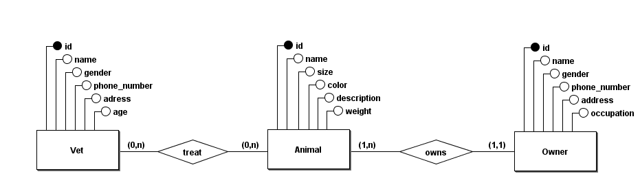

## Modelagem

* (requisito) Animal n-1 Owner
* (bonus) Vet n-n Animal

### Rotas

#### Animal
Route::get('/animals', 'AnimalController@list');

Route::get('/animals/{id}', 'AnimalController@show');

Route::post('/animals', 'AnimalController@create');

Route::put('/animals/{id}', 'AnimalController@update');

Route::delete('/animals/{id}', 'AnimalController@delete');
##### Animal - Owner
Route::post('/animals/{id}/owner', 'AnimalController@updateOwner');

Route::delete('/animals/{id}/owner', 'AnimalController@deleteOwner');
##### Animal - Vet
Route::get('/animals/{id}/vets', 'AnimalController@listVets');

Route::post('/animals/{id}/vet', 'AnimalController@addVet');

Route::delete('/animals/{id}/vet', 'AnimalController@deleteVet');

#### Vet 
Route::get('/vets', 'VetController@list');

Route::get('/vets/{id}', 'VetController@show');

Route::post('/vets', 'VetController@create');

Route::put('/vets/{id}', 'VetController@update');

Route::delete('/vets/{id}', 'VetController@delete');

##### Vet - Animal
Route::get('/vets/{id}/animals', 'VetController@listAnimals');

Route::post('/vets/{id}/animal', 'VetController@addAnimal');

Route::delete('/vets/{id}/animal', 'VetController@deleteAnimal');

#### Owner
Route::get('/owners', 'OwnerController@list');

Route::get('/owners/{id}', 'OwnerController@show');

Route::post('/owners', 'OwnerController@create');

Route::put('/owners/{id}', 'OwnerController@update');

Route::delete('/owners/{id}', 'OwnerController@delete');

##### Owner - Animals

Route::get('/owners/{id}/animals', 'OwnerController@listAnimals');

## License

The Laravel framework is open-source software licensed under the [MIT license](https://opensource.org/licenses/MIT).
